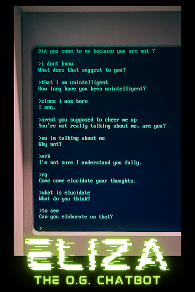

# 2024-ai-crash-course-eliza
A simple implementation of ELIZA, the original chatbot. Made for the Computer Coach 2024 AI crash course.

## Introduction

**ELIZA was the original chatbot, created by computer scientist [Joseph Weizenbaum](https://en.wikipedia.org/wiki/Joseph_Weizenbaum) at [MIT’s Artificial Intelligence Lab](https://projects.csail.mit.edu/films/aifilms/AIFilms.html) over a two-year period from 1964 to 1966.** It simulated a psychotherapist that reflects what the patient says back at them or gets the patient to talk about what they just said. It did this by finding patterns in the user’s input and matching it to an appropriate “canned” reply.

This Jupyter Notebook starts by covering some useful string processing features in Python and then uses those features to recreate ELIZA.
